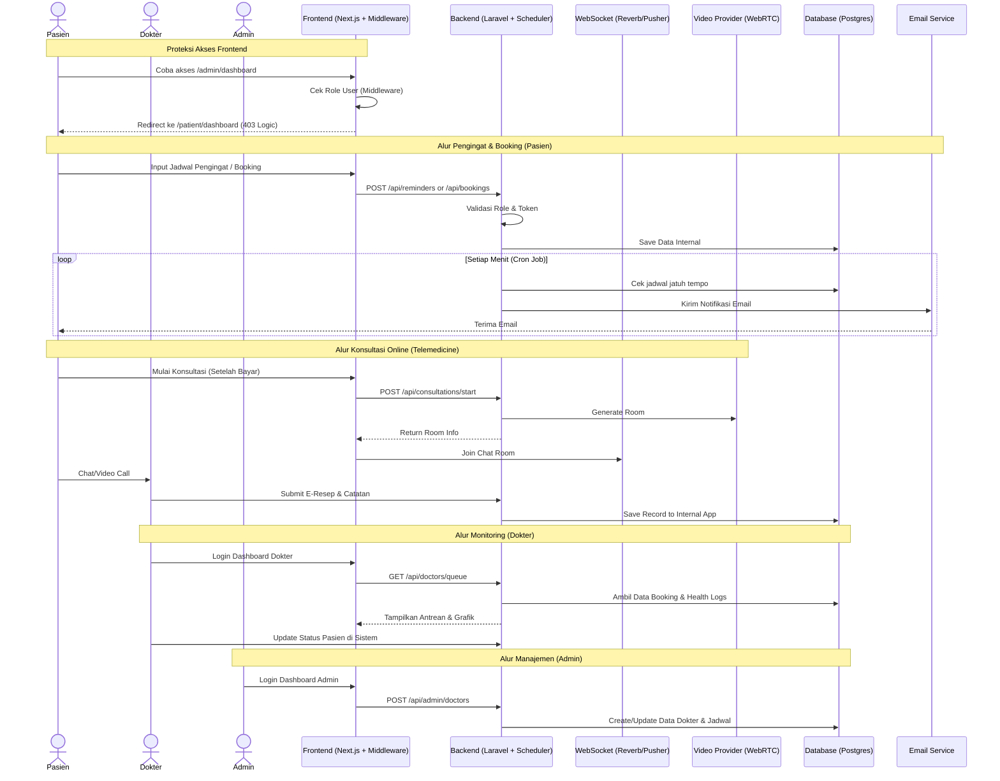
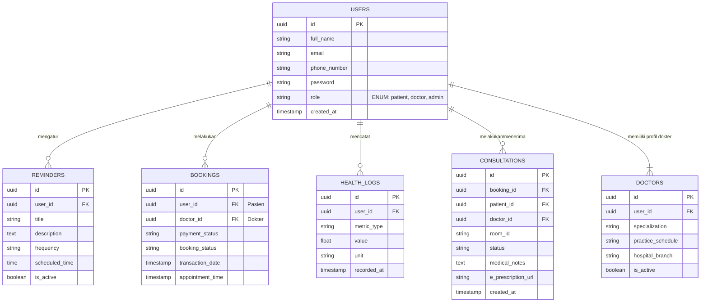

# PRD — Project Requirements Document

## 1. Overview
Aplikasi ini adalah platform rumah sakit digital komprehensif yang dirancang menyerupai portal online terkemuka (seperti Siloam Hospitals). Masalah utama yang ingin diselesaikan adalah antrean panjang di rumah sakit, kesulitan pasien dalam mendapatkan informasi jadwal dokter, promo, serta melakukan pendaftaran secara mandiri, serta kebutuhan manajemen internal bagi dokter dan admin rumah sakit. Tujuan utama aplikasi ini adalah memberikan pengalaman yang mulus bagi pasien untuk mencari jadwal dokter, melakukan pendaftaran (booking) secara online, membayar melalui berbagai metode digital, serta mendapatkan edukasi kesehatan atau informasi promo dari rumah sakit melalui satu platform terpadu. Keamanan akses pasien menjadi prioritas utama melalui verifikasi nomor telepon. Aplikasi ini bertujuan untuk mengenali pasien melalui profil medis internal yang tersimpan di dalam platform untuk keamanan dan akurasi penanganan medis. Transparansi finansial juga menjadi fokus melalui penyediaan riwayat transaksi yang lengkap. Fitur tambahan berupa Pemantauan Kesehatan Mandiri (Personal Health Monitoring) serta Pengingat Kesehatan Otomatis diberdayakan untuk memastikan pasien dapat memantau kondisi mereka dan tetap patuh pada rencana pengobatan atau pengecekan rutin. Platform ini menyediakan portal khusus bagi Dokter untuk memantau antrean dan data kesehatan pasien, serta panel Admin untuk manajemen operasional seluruh platform. **Penting:** Sistem harus menjamin isolasi ketat antar peran (Role-Based Access Control), di mana halaman Dashboard Dokter dan Panel Admin tidak dapat diakses, dilihat, atau dirender oleh pengguna dengan role Pasien atau pengunjung umum, baik melalui antarmuka (UI) maupun akses API langsung. Platform ini juga mencakup **Konsultasi Online (Telemedicine)** untuk memfasilitasi perawatan jarak jauh melalui chat dan panggilan video yang aman.

## 2. Requirements
- **Kapasitas Lalu Lintas Tinggi:** Sistem harus dirancang dan dioptimalkan untuk mampu menangani lebih dari 10.000 pengguna secara bersamaan tanpa penurunan performa yang signifikan.
- **Keamanan Profil Pasien & Verifikasi OTP:** Pengguna diwajibkan untuk melakukan pembuatan akun dan login sebelum dapat melakukan *booking*. Registrasi dan login wajib menggunakan nomor telepon aktif yang divalidasi melalui kode OTP (One-Time Password) dan kata sandi.
- **Manajemen Akses Berbasis Peran (RBAC) Ketat:** Sistem harus membagi akses pengguna menjadi tiga role utama: Pasien, Dokter, dan Admin. Setiap role memiliki hak akses, tampilan dashboard, dan rute API yang terpisah secara ketat.
- **Isolasi Antarmuka (UI Isolation):** Halaman Dashboard Dokter dan Panel Admin harus dilindungi di sisi frontend sehingga tidak dapat diakses oleh URL langsung oleh pengguna yang tidak berhak (Pasien/Public). Jika diakses, sistem harus me-redirect ke halaman yang sesuai atau menampilkan error 403.
- **Pemulihan Akun Aman:** Sistem menyediakan mekanisme "Lupa Kata Sandi" menggunakan verifikasi nomor telepon dan OTP.
- **Transaksi Digital Terpadu:** Sistem harus terintegrasi dengan penyedia layanan pembayaran digital pihak ketiga (Payment Gateway) untuk mendukung transaksi online yang aman.
- **Riwayat Transaksi & Invoice:** Sistem wajib menyimpan seluruh historis transaksi pembayaran pasien di database internal dan menyediakan fitur unduh invoice/e-tiket secara mandiri.
- **Manajemen Konten Dinamis:** Platform memungkinkan admin rumah sakit memperbarui konten artikel kesehatan, jadwal dokter, promo, dan berita secara mandiri melalui CMS internal.
- **Pemantauan Kesehatan Mandiri:** Sistem memungkinkan pasien mencatat data kesehatan harian (log) yang dapat diakses oleh dokter melalui dashboard dokter (dengan izin pasien).
- **Penjadwalan Pengingat Otomatis:** Sistem harus mendukung penjadwalan otomatis untuk pengingat kesehatan (obat, cek rutin, atau input log kesehatan) yang dikirimkan secara tepat waktu melalui email terdaftar pasien.
- **Privasi Data Medis:** Akses dokter terhadap data kesehatan mandiri pasien di dalam aplikasi hanya diperbolehkan jika pasien tersebut memiliki jadwal praktik dengan dokter bersangkutan atau memberikan izin akses eksplisit.
- **Proteksi API Endpoints:** Setiap endpoint API harus memvalidasi token pengguna dan memastikan role pengguna sesuai dengan akses yang diminta (misal: Pasien tidak bisa memanggil endpoint `/api/admin/users`).
- **Keamanan Konsultasi Real-Time:** Sesi konsultasi (chat/video) harus dilindungi dengan enkripsi dan standar keamanan tinggi, serta hanya dapat diakses oleh Pasien dan Dokter yang terlibat dalam sesi tersebut.
- **Ketersediaan Layanan Real-Time:** Sistem harus menjamin ketersediaan layanan chat dan video call dengan latency rendah menggunakan teknologi WebSocket dan WebRTC.

## 3. Core Features
- **Manajemen Akun & Role:** Registrasi OTP, Login, Profil Pengguna, Pemulihan Kata Sandi, dan pemisahan role (Pasien, Dokter, Admin) dengan redirect otomatis pasca-login berdasarkan role.
- **Profil Medis Internal:** Penyimpanan golongan darah, alergi, riwayat penyakit, dan riwayat kunjungan yang tercatat di dalam platform.
- **Pemantauan Kesehatan Mandiri (Personal Health Monitoring):** Input data kesehatan harian (BP, Gula Darah, Kolesterol, dll) dan visualisasi grafik tren kesehatan.
- **Pengingat Kesehatan Otomatis (Automated Health Reminders):**
  - Fitur untuk mengatur jadwal minum obat, jadwal cek laboratorium rutin, atau pengingat pengisian log kesehatan.
  - Pengiriman notifikasi otomatis berupa email ke alamat pengguna sesuai jadwal yang telah diatur (frekuensi harian, mingguan, atau sekali waktu).
- **Pencarian & Penjadwalan Dokter:** Pencarian berdasarkan spesialisasi, nama, atau cabang serta visualisasi ketersediaan slot.
- **Online Booking System:** Pemesanan jadwal dokter secara langsung dengan pemilihan slot waktu melalui database jadwal internal.
- **Pembayaran Online Fleksibel:** Integrasi Virtual Account, E-Wallet, dan Kartu Kredit melalui Payment Gateway.
- **Riwayat Transaksi & Invoice:** Halaman historis booking, status transaksi, dan fitur unduh invoice PDF.
- **Pusat Informasi & Edukasi (CMS):** Artikel kesehatan, berita rumah sakit, dan promo layanan medis (Akses Public).
- **Konsultasi Online (Telemedicine):**
  - **Chat Real-Time:** Fitur obrolan teks aman antara Pasien dan Dokter.
  - **Video Call Terintegrasi:** Fitur panggilan video langsung dalam aplikasi (WebRTC).
  - **E-Resep & Catatan Medis:** Dokter dapat menerbitkan resep digital dan catatan hasil konsultasi yang tersimpan di riwayat medis internal platform.
- **Dashboard Dokter (Terproteksi):**
  - **Akses Eksklusif:** Hanya untuk role "Dokter".
  - Melihat daftar antrean pasien yang melakukan booking melalui platform.
  - Mengakses profil medis internal dan grafik kesehatan mandiri pasien yang sedang ditangani.
  - Menerima notifikasi permintaan konsultasi online dan melakukan input hasil konsultasi (E-Resep).
- **Panel Admin (Terproteksi):**
  - **Akses Eksklusif:** Hanya untuk role "Admin".
  - Manajemen Data Dokter (Tambah/Edit/Hapus akun, spesialisasi, jadwal praktik).
  - Manajemen Konten (Artikel, Promo, Berita).
  - Pemantauan Transaksi Global Platform dan Manajemen User.

## 4. User Flow
1. **Eksplorasi (Public/Pasien):** Pengunjung melihat promo dan mencari dokter di beranda tanpa login.
2. **Pencarian Dokter (Public/Pasien):** Pengguna mencari spesialisasi dan melihat jadwal ketersediaan.
3. **Autentikasi (All Roles):** Registrasi/Login dengan nomor telepon & OTP. Sistem mendeteksi role dan melakukan redirect (Pasien ke Dashboard Pasien, Dokter ke Dashboard Dokter, Admin ke Panel Admin).
4. **Alur Lupa Kata Sandi:** Input nomor telepon -> Verifikasi OTP -> Set kata sandi baru.
5. **Proteksi Akses (Security Flow):** Middleware melakukan validasi role. Jika terdapat ketidaksesuaian role (misal Pasien akses URL Admin), sistem melakukan redirect atau menampilkan error 403.
6. **Alur Pasien (Booking & Monitoring):**
   - Pilih dokter & slot -> Bayar -> Terima E-Tiket.
   - Input Log Kesehatan Harian -> Lihat Grafik profil kesehatan di platform.
   - Set Pengingat Kesehatan -> Terima Email Notifikasi.
   - **Alur Konsultasi:** Pilih sesi online -> Bayar -> Masuk Ruang Chat/Video -> Selesai -> Terima E-Resep digital.
7. **Alur Dokter (Monitoring & Praktik):**
   - Login Dashboard Dokter -> Lihat Daftar Antrean internal platform.
   - Terima Notifikasi Konsultasi Masuk -> Masuk Ruang Chat/Video.
   - Klik Profil Pasien -> Lihat Riwayat Medis & Grafik Kesehatan Mandiri yang tercatat di sistem.
   - Input Catatan Konsultasi & E-Resep ke database platform.
8. **Alur Admin (Manajemen):**
   - Login Panel Admin -> Kelola Data Dokter, Jadwal, dan Konten CMS.
   - Pantau Laporan Transaksi aplikasi.
9. **Eksekusi Notifikasi (System):** Task Scheduler backend mengecek jadwal dan mengirimkan email pengingat kepada pasien secara otomatis.
10. **Konfirmasi Data:** Sistem memperbarui status booking dan riwayat medis secara internal di database aplikasi.

## 5. Architecture
Sistem menggunakan arsitektur *Headless* (Next.js & Laravel). Penjadwalan pengingat menggunakan sistem antrean (Queue) dan Task Scheduler di sisi server. Akses API diproteksi menggunakan Middleware berbasis Role (RBAC). Frontend Routing juga dilindungi menggunakan Middleware Next.js. Layanan real-time (Chat & Video) menggunakan WebSocket dan WebRTC provider.

## 6. Database Schema

## 7. Tech Stack
- **Frontend:** **Next.js** (React) dengan **Recharts** untuk visualisasi tren kesehatan. Implementasi **Role-Based UI** untuk Dashboard Pasien, Dokter, dan Admin.
- **Frontend Security:** **Next.js Middleware** untuk perlindungan rute berdasarkan role sebelum render.
- **Backend:** **Laravel** (PHP). Memanfaatkan **Laravel Task Scheduler** dan **Queue System** untuk pengiriman pengingat email otomatis.
- **Real-Time Communication:** 
  - **WebSocket:** **Laravel Reverb** atau **Pusher** untuk fitur chat real-time.
  - **Video Call:** **WebRTC** (Daily.co / Jitsi Meet API) untuk panggilan video terintegrasi.
- **Authentication:** **Laravel Sanctum** untuk API Token Management. **Middleware RBAC** di Backend untuk proteksi endpoint.
- **Database:** **PostgreSQL** untuk penyimpanan seluruh data transaksional, medis, dan profil secara internal.
- **Email Service Provider:** **Mailgun** atau **Amazon SES** untuk notifikasi pengingat kesehatan.
- **SMS Gateway:** **Twilio/Fonnte** untuk verifikasi OTP.
- **Infrastruktur:** **AWS/DigitalOcean** dengan **Redis** untuk caching dan manajemen antrean pesan.